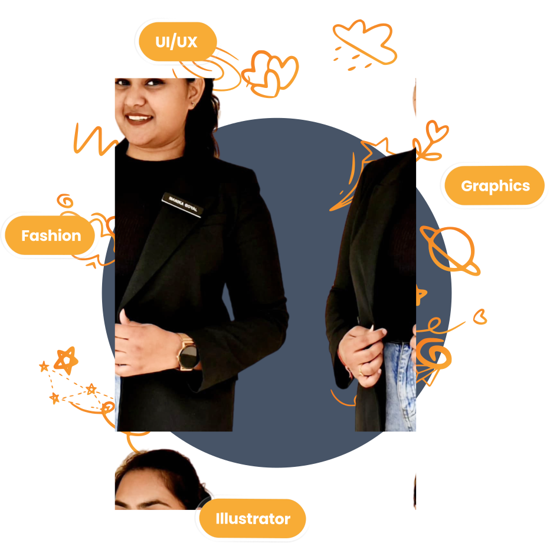

# 🎨 Manika Goyal – Creative Design Portfolio

Welcome to my personal portfolio!  
This website reflects my journey as a **designer**, showcasing selected works in **UI/UX**, **illustration**, **fashion design**, and **graphic design** — all in one seamless experience.

---

## 🚀 Tech Stack

- **Next.js 15** – App Router + Image Optimization
- **Tailwind CSS** – Utility-first, responsive design
- **Framer Motion** – Smooth animations and transitions
- **SwiperJS** – Interactive sliders
- **React Icons** – Scalable vector icons
- **Responsive Design** – Fully optimized for all screen sizes

---

## ✨ Features

- 🔥 Hero section with animated image swap on hover using **Framer Motion**
- 🧠 "About Me" section with grid-based storytelling layout
- 📌 Vertical **Timeline** with dashed connectors & hover interactions
- 🎨 Dynamic **Projects Filter** by category (UI/UX, Illustrations, etc.)
- 🛠️ Animated **Tools Carousel** built with **SwiperJS**
- 🎭 Fluid, minimalistic UI with consistent typography
- 📱 100% Responsive and mobile-first design

